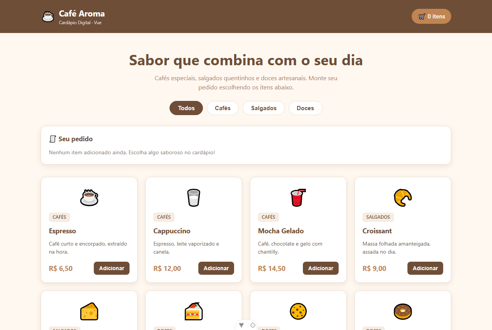
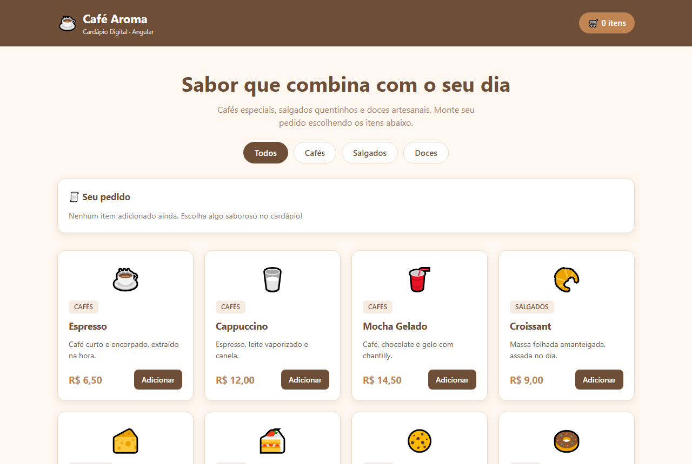
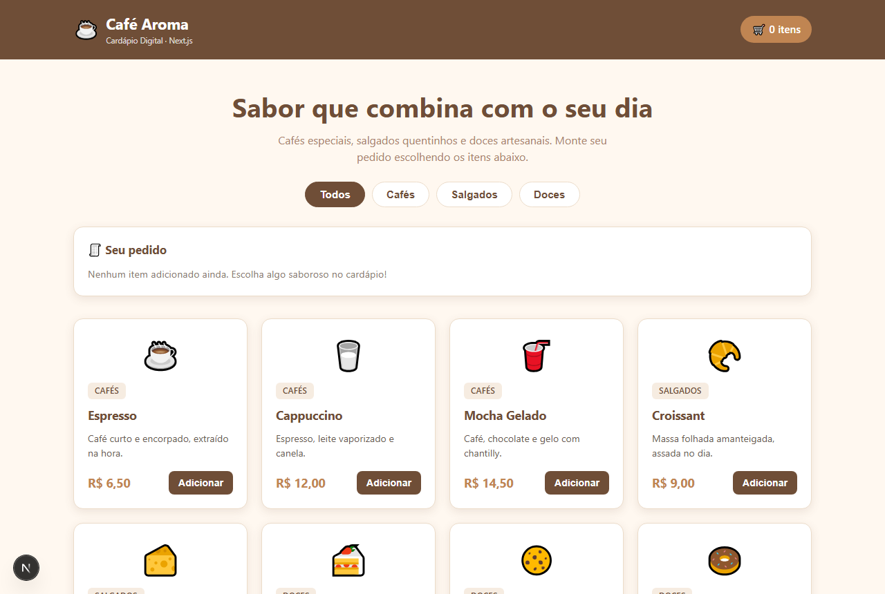
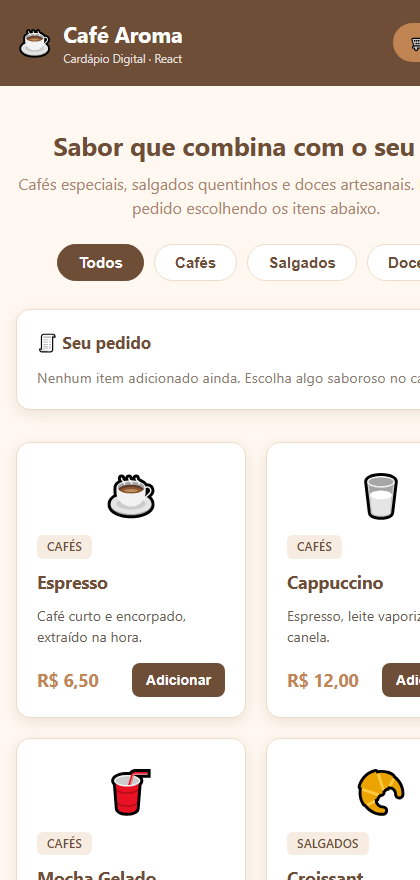

<div align="center">

# 🎓 Frameworks Front-end

**SENAI · Prof. Me. Deivison S. Takatu**
Repositório das atividades da disciplina — por **Gustavo Ribas Silestrino**


</div>

---

## 🌐 Sites publicados

| Projeto | Tecnologia | Acessar o site | Código |
|:--:|---|:--:|:--:|
| **01** | ⚛️ React 19 + Vite | **[cardapio-react-phi.vercel.app](https://cardapio-react-phi.vercel.app)** | [📂 ver](Atividade/Aula%202/cardapio-react) |
| **02** | 💚 Vue 3 + Vite | **[cardapio-vue-one.vercel.app](https://cardapio-vue-one.vercel.app)** | [📂 ver](Atividade/Aula%203/cardapio-vue) |
| **03** | 🅰️ Angular | **[cardapio-angular.vercel.app](https://cardapio-angular.vercel.app)** | [📂 ver](Atividade/Aula%204/cardapio-angular) |
| **04** | ▲ Next.js (App Router) | **[cardapio-next-khaki.vercel.app](https://cardapio-next-khaki.vercel.app)** | [📂 ver](Atividade/Aula%205/cardapio-next) |
| **05** | 📦 Cópia de repositório | [frontend-summary](https://github.com/Arthur-2612/frontend-summary) *(do Arthur)* | [📂 ver](Atividade/Aula%206) |

---

## 🍽️ Sobre os projetos

O mesmo site — o **Cardápio Digital da cafeteria Café Aroma** — desenvolvido **quatro vezes**,
uma em cada tecnologia. Mesmo layout, mesmas funcionalidades, mesma base de dados: a única
variável é o framework.

| | |
|---|---|
| 🧾 **Cardápio** | 8 produtos em cards responsivos com CSS Grid |
| 🏷️ **Filtro** | Por categoria: Todos, Cafés, Salgados, Doces |
| 🛒 **Carrinho** | Adicionar, remover, quantidade e total em R$ |
| ⚡ **Reatividade** | O título da aba muda conforme o pedido |
| 📱 **Responsivo** | Do desktop até uma coluna no celular |

---

## 👀 Prévia

### ⚛️ Projeto 01 — React

[](https://cardapio-react-phi.vercel.app)

### 💚 Projeto 02 — Vue

[](https://cardapio-vue-one.vercel.app)

### 🅰️ Projeto 03 — Angular

[](https://cardapio-angular.vercel.app)

### ▲ Projeto 04 — Next.js

[](https://cardapio-next-khaki.vercel.app)

### 📱 Responsivo

<div align="center">

</div>

Em telas de até 480px o grid vira uma coluna única e o cabeçalho se reorganiza.

---

## 🗂️ Estrutura do repositório

```
Frontend/
├── Atividade/          # as entregas práticas
│   ├── Aula 1/         # HTML + CSS + JS puro
│   ├── Aula 2/         # Projeto 01 — React
│   ├── Aula 3/         # Projeto 02 — Vue
│   ├── Aula 4/         # Projeto 03 — Angular
│   ├── Aula 5/         # Projeto 04 — Next.js
│   ├── Aula 6/         # Projeto 05 — cópia de repositório
│   ├── COMPARACAO.md   # comparação entre as tecnologias
│   └── LINKS.MD        # repositórios e deploys
├── Aulas/              # links dos slides do professor
├── Materia/            # artigo sobre React
└── docs/preview/       # imagens usadas neste README
```

---

## 📚 Documentação

| Documento | O que tem |
|---|---|
| [Atividade/README.md](Atividade/README.md) | Índice detalhado das entregas |
| [Atividade/COMPARACAO.md](Atividade/COMPARACAO.md) | Comparação entre React, Vue, Angular e Next.js |
| [Atividade/LINKS.MD](Atividade/LINKS.MD) | Links de repositórios e deploys |
| [Aulas/README.md](Aulas/README.md) | Slides das aulas no repositório do professor |

---

<div align="center">

**Gustavo Ribas Silestrino**

[](https://github.com/GustavoRibasSilestrino)

</div>
